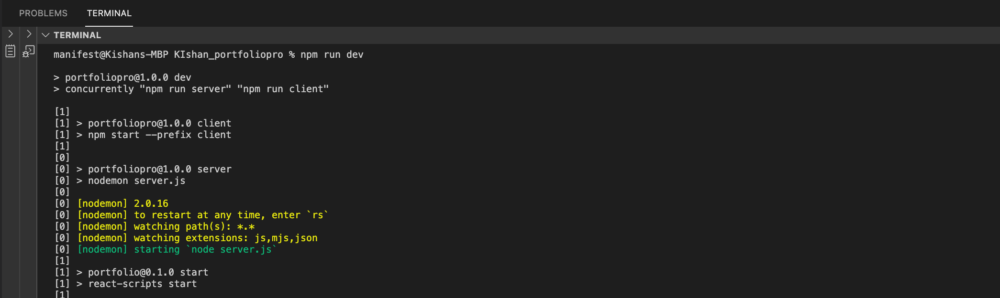
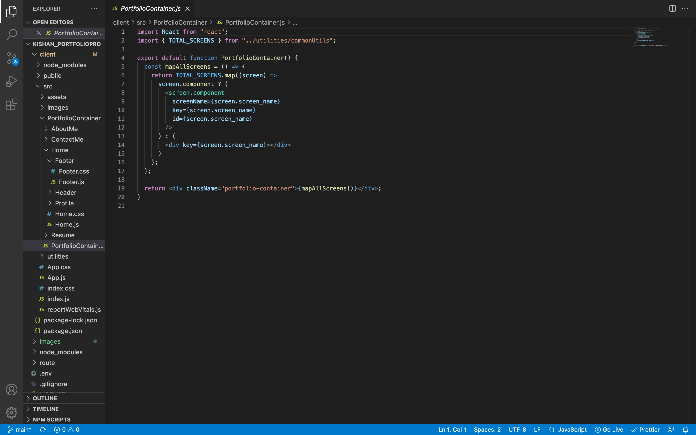
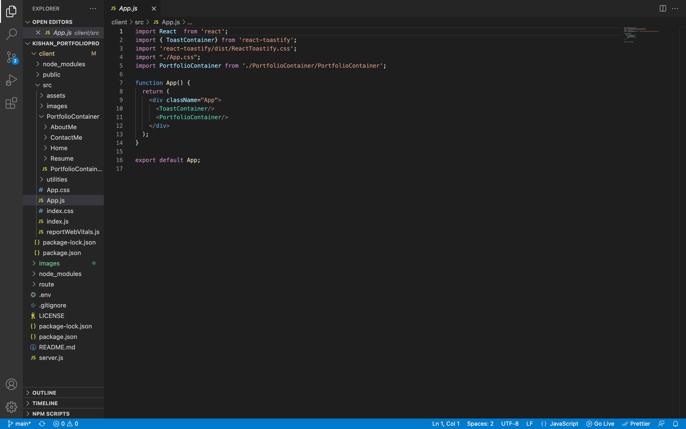
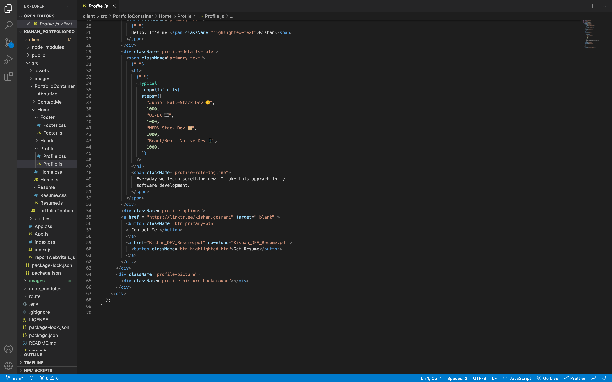
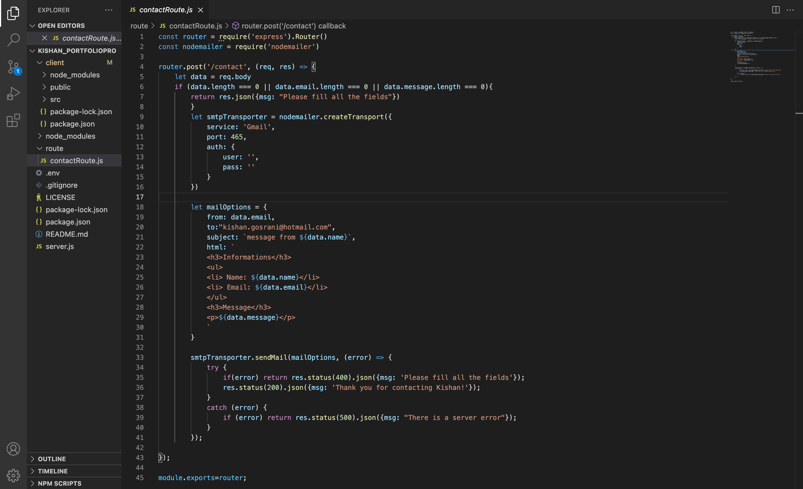

# Portfolio
This is my portfolio which I created using react.js

## Description

This is an app I created using the react.js framework in which I have added my resume, and my contact details for potential clients to reach me

- VIDEO OF WALKTHROUGH is below

## Tabel of Contents

* [Installation](#installation)
* [Usage](#usage)
* [Contribute](#contribute)
* [Tests](#tests)
* [Screenshots](#screenshots)
* [Technology](#technology)
* [Making](#making)
* [Questions](#questions)

## Installation

In order to run this application, you will need to install the following

### Client terminal
- npm install

### Root terminal
- npm install

### TroubleShoot

in client -> npm audit fix then cd .. to go back to the root terminal of the project

## Usage

In order to use this app, you will need to understand the following;

- React
- nodemon
- nodemailer
- Javascript

## Contribute

In order to contribute to this app, you will need to understand the following;

- React
- nodemon
- nodemailer
- Javascript

## Tests

To run tests, please use the following command in the root terminal:

- npm run dev

## Screenshots

- npm run dev

## Technology

- Github
- HTML
- CSS
- Javascript
- React.js
- Nodemailer
- Nodemon

## Making

These are the screenshots of the code 

- Portfolio Container

- App.JS

- Profile.JS

- Resume.js

- ContactRoute

## Questions

Please click the links below

[Github] (https://github.com/kishan254)

Write me on;

[Email] (kishan.gosrani@hotmail.com)

## License

This project is currently licensed under the MIT [License](https://choosealicense.com/licenses/mit/)